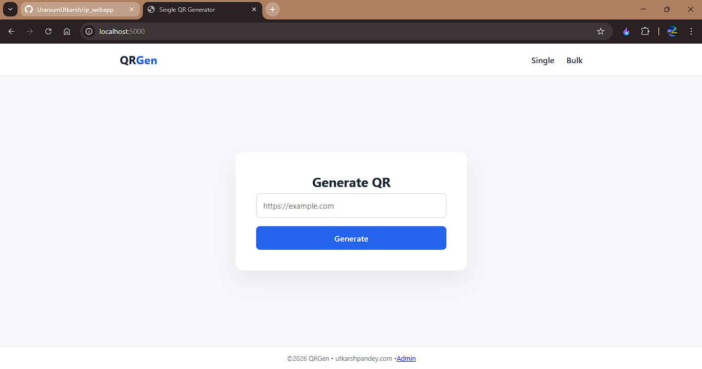
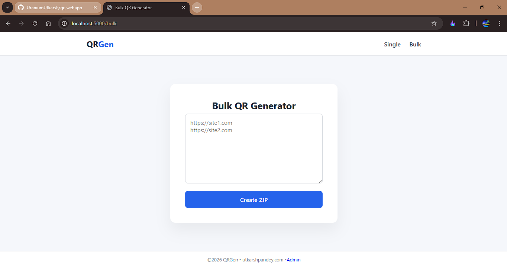

# QRGen — Serverless QR Code Generator

QRGen is a **clean, privacy-focused, serverless QR Code Generator** built with **Flask**, designed to run on **Vercel** with **Upstash Redis** for temporary logging.

It supports:
- Single QR generation
- Bulk QR generation (ZIP download)
- No user login
- No local file storage
- Admin panel (password-protected)
- Automatic data expiry (30 days via Redis TTL)

---

## Features

- **Fast & Serverless** (Vercel compatible) | yet not deployed
- **Privacy-first** (no QR images stored on disk)
- **Bulk QR generation** with ZIP download
- **Redis-based logging** with automatic expiry
- **Admin panel** for monitoring & manual cleanup
- **Clean, premium UI**

---

## Screenshots

### Single QR Generation


### Bulk QR Generation


---

## Tech Stack

- **Backend**: Flask (Python)
- **QR Generation**: `qrcode` + `Pillow`
- **Storage**: Upstash Redis (TTL-based, no tables)
- **Hosting**: Vercel (Serverless) | Not deployed
- **Frontend**: HTML, CSS, JavaScript (no framework)

---

## Project Structure

qrgen/
│
├── api/
│ └── index.py # Vercel serverless Flask app
│
├── templates/
│ ├── base.html
│ ├── index.html
│ ├── bulk.html
│ └── admin.html
│
├── static/
│ ├── css/style.css
│ └── js/main.js
│
├── Github_images/
│ ├── singleqr.png
│ └── bulkqr.png
│
├── requirements.txt
├── vercel.json
└── README.md


---

## Deployment (Vercel)
Not applicable as of now!

### Clone the repo
```bash
git clone https://github.com/UraniumUtkarsh/qrgen.git
cd qrgen